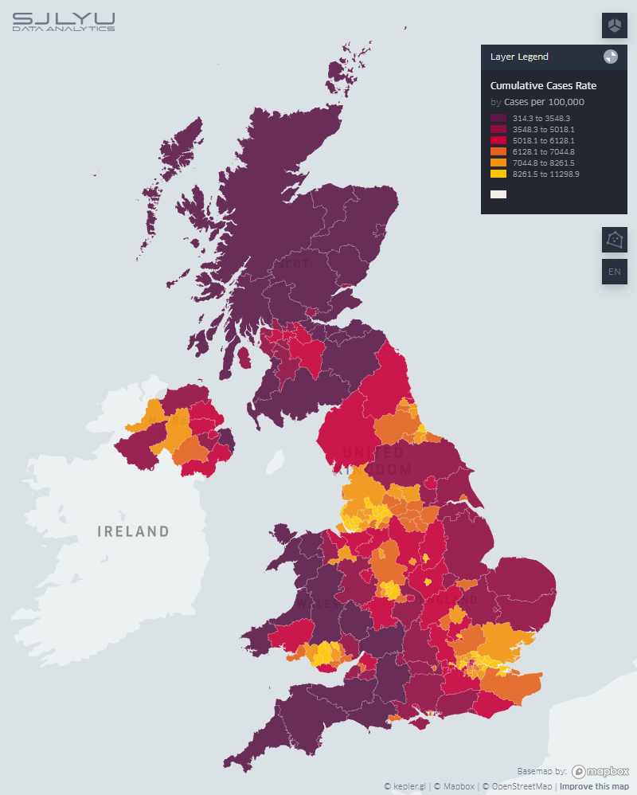

# Data Visualization

### *of UK COVID-19 UTLA infection rates using kepler.gl*

#### Interactive visualization is available at: https://covid-map.shangjielyu.com/

### Data Sources

[1] [COVID-19 UK API](https://coronavirus.data.gov.uk/details/developers-guide) by Public Health Englend (PHE) (*[Open Government Licence](https://www.nationalarchives.gov.uk/doc/open-government-licence/version/3/)*)

[2] [Geography Boundaries](https://geoportal.statistics.gov.uk/) by Office for National Statistics (ONS) (*[Open Government Licence](https://www.nationalarchives.gov.uk/doc/open-government-licence/version/3/)*)
